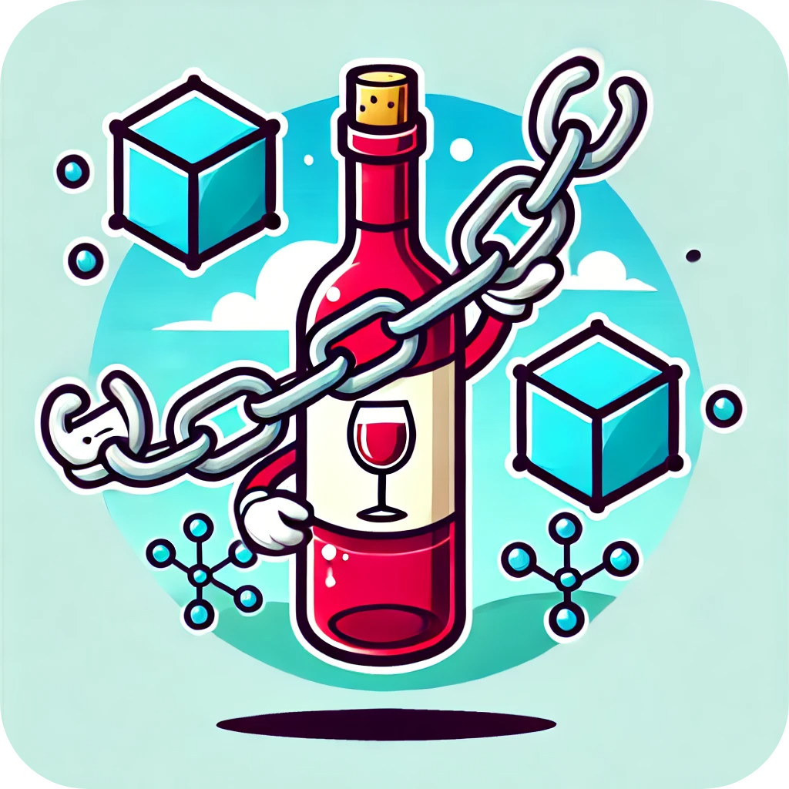

# WineChain 🍷🔗



WineChain is a university project developed for the Data Security course at the University of Salerno. This project leverages blockchain technology (Ethereum) to ensure the transparency and security of wine production. Administrators can create wine batches and add detailed information to the blockchain, while users can scan a QR code on the wine bottle to access the stored blockchain data. 🍇

## Table of Contents

- [WineChain 🍷🔗](#winechain-)
  - [Table of Contents](#table-of-contents)
  - [Features](#features)
  - [Technologies](#technologies)
  - [Installation](#installation)
  - [Running the Project](#running-the-project)
    - [Setting Up the Blockchain](#setting-up-the-blockchain)
    - [Setting Up the Application](#setting-up-the-application)

## Features

- **Blockchain Integration:** Securely stores wine batch information on the Ethereum blockchain. 🔒
- **QR Code Verification:** Allows users to scan the QR code on the wine bottle to retrieve blockchain data. 📱
- **Admin Management:** Administrators can create and manage wine batches with detailed data. 👩‍💻
- **User Authentication:** Implements secure authentication using Better-auth with an SQLite database. 🔑
- **Modern UI:** Built with Nuxt, TailwindCSS, and NuxtUI v3 for a responsive and sleek user experience. 🎨

## Technologies

- **Nuxt:** Server-side rendering framework for Vue.js.
- **TailwindCSS:** Utility-first CSS framework.
- **NuxtUI v3:** UI component library for Nuxt.
- **Better-auth:** Lightweight authentication library using SQLite.
- **Hardhat:** Ethereum development environment for compiling, deploying, and testing smart contracts.

## Installation

1. **Clone the Repository**

   ```bash
   git clone https://github.com/yourusername/winechain.git
   ```

   _Clones the WineChain repository to your local machine._

2. **Install Dependencies**
   ```bash
   pnpm install
   ```
   _Installs all required packages and dependencies for the project._

## Running the Project

### Setting Up the Blockchain

1. **Compile Smart Contracts**

   ```bash
   pnpm run hardhat:compile
   ```

   _Compiles the Ethereum smart contracts using Hardhat._

2. **Start the Local Blockchain**

   ```bash
   pnpm run hardhat:start
   ```

   _Starts a local Ethereum blockchain network. The terminal will display important configuration details required for later steps._

3. **Deploy Smart Contracts**
   ```bash
   pnpm run hardhat:deploy
   ```
   _Deploys the compiled smart contracts to the local blockchain network._

### Setting Up the Application

1. **Run Database Migrations**

   ```bash
   pnpm run db:migrate
   ```

   _Executes the database migration scripts to set up the necessary schema._

2. **Seed Default User**

   ```bash
   pnpm run db:seed-user
   ```

   _Seeds the database with a default administrative user (email: `admin@winechain.com`, password: `admin123`)._

3. **Create and Configure the Environment Variables**

   - Create a `.env` file in the root directory of the project.
   - Insert the necessary values (these can be taken from the output of `pnpm run hardhat:start`).

   **Example `.env` file:**

   ```env
   ### BLOCKCHAIN ###
   NUXT_PUBLIC_BC_URL=http://127.0.0.1:8545
   NUXT_PUBLIC_BC_CONTRACT_ADDRESS=
   NUXT_BC_PRIVATE_KEY=
   ```

4. **Start the Development Server**
   ```bash
   pnpm run dev
   ```
   _Launches the Nuxt development server, making the WineChain application accessible locally._
